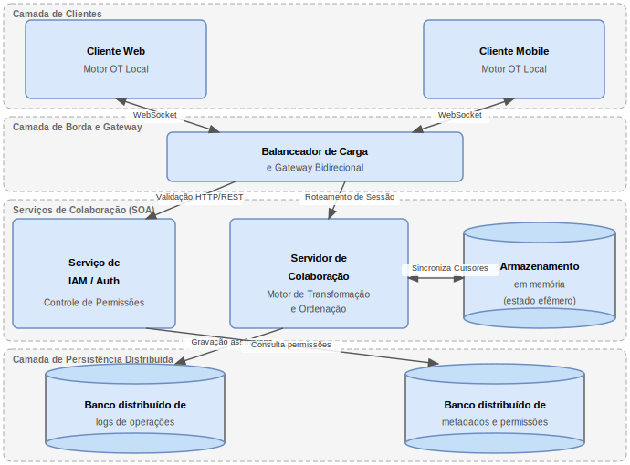

# Sistemas Distribuídos e Redes de Computadores

**Instituição:** Universidade Evangélica de Goiás — UniEVANGÉLICA  
**Disciplina:** Sistemas Distribuídos e Redes de Computadores  
**Autor:** Lucas Marques Maciel  
**Ano:** 2026

---

## Sobre o Projeto

Este repositório contém o trabalho acadêmico da disciplina de **Sistemas Distribuídos e Redes de Computadores**, composto por dois entregáveis:

1. **Relatório Acadêmico** — Estudo teórico sobre sistemas distribuídos com análise de caso do Google Docs e proposta de arquitetura conceitual.
2. **Implementação Prática** — Aplicação de chat distribuído em Python, demonstrando os conceitos de comunicação cliente-servidor, assincronia e sincronização.

---

## Estrutura do Repositório

```
📦 Trabalho_Sistemas_Distribuidos_UNIEVA
├── 📄 README.md                          ← Este arquivo
├── 📄 LICENSE
├── 📄 .gitignore
└── 📁 relatorio-sistemas-distribuidos/
    ├── 📄 README.md                      ← Documentação técnica da implementação
    ├── 🐍 server.py                      ← Servidor TCP multithread
    ├── 🐍 client.py                      ← Cliente TCP com thread de recepção
    ├── 🌐 index.html                     ← Relatório acadêmico completo (HTML/ABNT)
    ├── 🎨 style.css                      ← Estilos ABNT para o relatório
    ├── 🖼️ fig1.svg                       ← Diagrama: arquitetura conceitual do Google Docs
    ├── 🖼️ fig2.svg                       ← Diagrama: arquitetura cliente-servidor do chat
    └── 🖼️ fig3.svg                       ← Diagrama: sequência do fluxo de mensagens
```

---

## Relatório Acadêmico

O relatório (`index.html`) aborda os seguintes tópicos:

- **Fundamentação Teórica** — Definição, características e desafios de sistemas distribuídos; paradigmas de comunicação; serviços de nomes; coordenação, consistência e replicação; Arquitetura Orientada a Serviços (SOA).
- **Estudo de Caso: Google Docs** — Análise do mecanismo de colaboração em tempo real, Transformação Operacional (OT), sincronização cliente-servidor e componentes do ecossistema Google (Bigtable, Chubby, Spanner).
- **Proposta de Arquitetura Conceitual** — Diagrama em camadas de uma aplicação colaborativa distribuída, embasado na literatura de sistemas distribuídos.
- **Implementação Prática** — Documentação da aplicação de chat desenvolvida, com relação direta aos conceitos teóricos.

> Para visualizar o relatório, abra o arquivo `relatorio-sistemas-distribuidos/index.html` em qualquer navegador.

### Arquitetura Conceitual — Aplicação Colaborativa em Tempo Real



---

## Implementação Prática — Chat Distribuído em Python

Uma aplicação de troca de mensagens em tempo real construída sobre **TCP/IP**, usando exclusivamente a biblioteca padrão do Python.

### Conceitos Demonstrados

| Conceito | Implementação |
|---|---|
| Arquitetura cliente-servidor | Topologia em estrela com servidor central TCP |
| Comunicação assíncrona | `threading.Thread` dedicada por conexão/recepção |
| Sincronização (Mutex) | `threading.Lock` protegendo o dicionário de clientes |
| Tolerância a falhas básica | Tratamento de exceções isolado por thread |

### Pré-requisitos

- Python 3.7 ou superior
- Nenhuma dependência externa (apenas biblioteca padrão)

### Como Executar

**1. Inicie o servidor** (em um terminal):

```bash
cd relatorio-sistemas-distribuidos
python server.py
```

```
[Servidor] Aguardando conexões em 0.0.0.0:5000 ...
[Servidor] Pressione Ctrl+C para encerrar.
```

**2. Conecte os clientes** (em terminais separados, um por cliente):

```bash
python client.py
```

```
Digite seu apelido: Alice
Conectado ao servidor 127.0.0.1:5000 como 'Alice'.
```

Repita o passo 2 em outro terminal com outro apelido (ex.: `Bob`) para simular múltiplos participantes.

### Exemplo de Sessão

```
# Terminal do Servidor
[+] Alice conectou-se de 127.0.0.1:52341
[Alice] Olá, pessoal!
[+] Bob conectou-se de 127.0.0.1:52342
[Bob] Oi Alice!
[-] Alice desconectou-se.

# Terminal do Cliente Alice
[Servidor] Bob entrou no chat.
[Bob] Oi Alice!
/sair
[Chat] Saindo...

# Terminal do Cliente Bob
[Alice] Olá, pessoal!
[Servidor] Alice saiu do chat.
```

### Comandos Disponíveis

| Comando | Ação |
|---|---|
| `/sair` | Encerra a conexão e fecha o programa |
| `Ctrl+C` | Interrupção de emergência |

---

## Referências

- COULOURIS, G. et al. *Sistemas Distribuídos: Conceitos e Projeto*. 5. ed. Porto Alegre: Bookman, 2013.
- TANENBAUM, A. S.; VAN STEEN, M. *Sistemas Distribuídos: Princípios e Paradigmas*. 2. ed. São Paulo: Pearson Prentice Hall, 2007.
- ELLIS, C. A.; GIBBS, S. J. Concurrency control in groupware systems. *ACM SIGMOD Record*, v. 18, n. 2, p. 399–407, 1989.
- FRASER, N. Differential Synchronization. *Google Research*, 2009.
- CHANG, F. et al. Bigtable: A distributed storage system for structured data. *ACM TOCS*, v. 26, n. 2, 2008.
- BURROWS, M. The Chubby lock service for loosely-coupled distributed systems. *OSDI*, USENIX, 2006.
